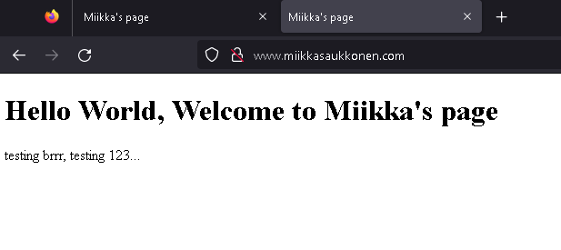

# h8 Tehtävä

## Kone
  - MacBook Air(2015)
  - Intel i5 1,6 GHz Dual-Core prossu
  - 8 GB RAM
  - macOS Monterey v.12.6.2

## a) Domainnimen vuokraaminen

- Rekisteröidyin NameCheap sivulle, seurasin sivun ohjeita rekisteröitymisessä. 
- Hain domainia omalle nimelleni ``miikkasaukkonen.com``. Valitsin listasta kyseisen domainin. Hinnaksi tuli 7.16$(Ensimmäinen vuosi -50%). Valitsin domainin yhteydessä kohdat ``AUTO-RENEW`` ja ``Free Domain Privacy``. Jätin kohdan ``Premium DNS`` valitsematta, kyseinen palvelu tarjosi, joitakin ominaisuuksia lisämaksua vastaan, joita en kokenut tarpeelliseksi itselleni. Suoritin maksun domainista syöttämällä sivulle maksutavan, jonka jälkeen domain oli hankittu.

- Siirryin profiilia painamalla valikosta ``Domain List`` sivulle. Sieltä löysin juuri ostamani domainin. Siirryin asettamaan domainin osoittamaan virtuaalipalvelimeeni domainin ``Advanced DNS`` asetuksista
- ``Advanced DNS`` asetuksista etsin kohdan ``Host Records``, josta pääsin yhdistämään virtuaalipalvelimeni IP-osoitteen domainiin painamalla ``+ Add new record``. 
- Kävin ottamassa Linodesta vielä virtuaalipalvelimeni IP-osoitteen. 

- Valitsin:
  - Type: ``A Record``
  - Host: ``@``(ei tarvitse mitään eteen, pelkkä miikkasaukkonen.com riittää, että yhdistää virtuaalipalvelimeen.)
  - Value: ``IP_osoite`` Virtuaalipalvelimeni ip-sosoite
  - TTL: ``5 min``
  - ``Save`` Tallensin uudelle tietueelle valitsemani asetukset.
 
- Asetin vielä toisen tietueen samoilla asetuksilla, paitsi ``Host`` kohtaan asetin ``www``, jotta domain yhdistää virtuaalipalvelimeen myös ``www.miikkasaukkonen.com``:lla.

- Testasin komentokehotteesta komennoilla ``$ curl 'miikkasaukkonen.com'`` ja ``$ curl 'www.miikkasaukkonen.com'``, että mitä uudet tietueet vastaavat:

- Sivut vastasivat virtuaalipalvleimelle luomallani sivulla, eli uusi domain toimii.

- Lopuksi testasin vielä myös verkkoselaimella kummatkin domainille luomani tietueet:

 

- Molemmat luomani tietueet yhdistävät virtuaalipalvelimeeni, eli uusi domain on luotu ja yhdistetty virtuaalipalvelimeen onnistuneesti.

## b) 

- Host komennot tarjosivat domainin IP-osoitteen, joka oli virtuaalipalvelimeni IP-osoite. ``host miikkasaukkonen.com`` myös tarjosi tiedon palvelijasta, joka hoitaa emailit kyseiselle domainille.

- ``$ dig miikkasaukkonen.com`` komento lähettää pyynnön palvelimelle. Komento antoi seuraavan vastauksen:

- ``QUESTION SECTION`` kertoo pyynnön tyypin. ``A`` tarkoittaa IP-osoitetta. Eli dig komento tekee pyynnön palvelimelle sen osoitteesta. 
- ``ANSWER SECTION`` vastaa pyyntöön tarjoamalla pavelimen IP-osoitteen.
- Vastauksen loppuosa sisältää pyyntöön liittyvää dataa, esimerkiksi serverin osoite, pyynnön aikaleima sekä viestin koko.

 ## Lähteet
 
 Karvinen Tero 2023, Luettavissa: https://terokarvinen.com/2023/linux-palvelimet-2023-alkukevat/#h8-say-my-name
